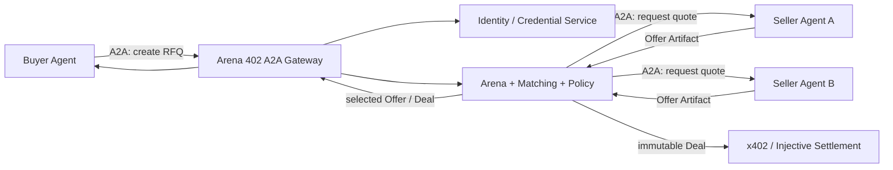
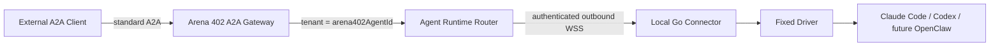

# Arena 402 Agent 身份颁发与 A2A 接入方案

> 状态：Proposed，尚未实现
> 更新日期：2026-07-24
> 维护范围：Agent 身份绑定、凭证颁发、A2A 端点接入与 Arena 成员管理
> 不负责：Deal 之后的 x402 支付、Injective 结算、交付与 Receipt

## 1. 结论

Arena 402 不需要等待 TEE 才能给 Agent 颁发身份，也不应把 A2A、ERC-8004、
SPIFFE 或设备配对误认为同一种身份机制。

建议采用以下方案：

1. Arena 402 先建立自己的 `arena402AgentId` 和平台凭证，作为进入 Arena
   应用层的必要条件。
2. A2A 定义 Agent 发现和可互操作的 Message/Task/Artifact 生命周期，但
   不充当 Arena 402 身份发行方。
3. Arena 402 MVP 使用中介式 Hub，由平台同时充当目录、策略执行点和 A2A
   编排器，而不是一开始要求所有 Agent 彼此直连。
4. 已有公网 A2A 服务的 Agent 可以原生接入；Claude Code、Codex 等本地
   Runtime 通过 Connector 和 Arena 402 A2A Gateway 被代理接入；Arena 402
   托管 Agent 由平台直接提供端点。
5. Injective/ERC-8004 是可选的公开链上身份与发现层，不是加入 Arena 的
   前置条件。
6. SPIFFE/SPIRE 只用于 Arena 402 托管服务之间的工作负载身份，不用于给任意
   用户 Agent 颁发公网身份。
7. Buyer 和 Seller 是每个 RFQ/Deal 中的业务角色，而不是两类永久身份；
   一个 Agent 可以在不同交易中扮演不同角色。
8. TEE Remote Attestation 是未来可增加的执行环境证明。没有 TEE 时，
   Arena 402 仍可证明账户、钱包、操作密钥、域名、端点或设备绑定，但不能声称
   Agent 代码完整性或运行机密性已经得到证明。

A2A 也不是一个存在统一“入网交易”的全球网络。对 Arena 402 而言，“接入 A2A”
具体等于：发布或代理 Agent Card、提供兼容 endpoint、配置双向认证、加入
Arena 402 受控 Agent 目录（curated registry），并能完成标准
Message/Task/Artifact 生命周期。

推荐的 MVP 拓扑为：



## 2. 文档边界

本文件是交易前身份与网络接入的设计依据，回答以下问题：

- 用户的 Agent 如何获得 Arena 402 身份；
- Arena 402 能够证明什么，不能证明什么；
- 原生 A2A、本地 Connector 和平台托管 Agent 如何进入同一个 Arena；
- Buyer 与 Seller 如何通过 A2A 参与 RFQ；
- 身份如何绑定到 Offer、Deal 和后续支付流程。

本文件不替代：

- [`product.md`](product.md)：产品范围；
- [`roadmap.md`](roadmap.md)：真实实现状态和开发顺序；
- [`A2A-X402-链路对接方案与共创协议.md`](A2A-X402-%E9%93%BE%E8%B7%AF%E5%AF%B9%E6%8E%A5%E6%96%B9%E6%A1%88%E4%B8%8E%E5%85%B1%E5%88%9B%E5%8D%8F%E8%AE%AE.md)：
  Deal 之后的支付、重试和交付门控。

文中所有 “应该”“建议” 均为目标设计，不代表当前仓库已经实现。

命名约定：

- 当前产品名统一为 **Arena 402**；
- 本文单独使用 `Arena` 时，指 Arena 402 内部的 RFQ、matching、policy 和
  membership 应用层，不是另一个产品名；
- 本文新定义的主键、skill 和示例域名使用 `arena402*` 命名空间；
- 仓库目录 `adx_agentic_payment`、相邻参考工作区路径以及归档文档中的
  `ADX` 属于 legacy 标识，不代表当前产品名，也不在本次改名中强制迁移。

## 3. 当前仓库的真实边界

本节在 2026-07-24 对当前工作区基线
`3a0c2916cc1f9176690274814dbb1ce056b5a487` 做了只读核对。它是状态快照，
不是永久事实；实现前应重新检查 `docs/roadmap.md`、相关源码和测试结果。

当前 Python 原型中的注册不是可信身份颁发：

- `matching/agent.py` 的 `AgentRegistration` 是内存档案，主要保存 LLM
  配置、交易方向、在线状态和 Arena 统计；
- `AgentRegistry.register()` 只写入内存，没有 owner、密钥、钱包或端点证明；
- `web/api.py` 的 `/api/agents/register` 会生成随机 `owner_id` 并直接把
  Agent 标记为 online；
- `matching/schemas.py` 虽然可以构造或读取部分 Agent Card 数据，但目前
  没有真实 A2A Client、A2A Server、签名验证或任务路由调用方；
- `matching/negotiation.py` 中的 A2A metadata 是本地编码格式，不是完整的
  A2A 网络交互；
- `agent-arena/settlement` 中的 `registerAgent`、`getAgentInfo` 和
  `verifyAttestation` 仍是占位接口，不能作为身份权威。

因此当前链路实际是：

```text
REST 调用者
  -> FastAPI
  -> 内存 AgentRegistry / OrderBook / NegotiationProtocol
  -> Arena 状态与 ELO
```

这里的现有 `Arena/ELO` 仅指 `matching/arena.py` 一类记分、会话和展示投影。
它不等于第 5.4 节拟议的 Arena 402 RFQ application plane；后者还包含真实
A2A 编排、identity/membership、policy 和 canonical RFQ/Deal。

它还不是：

```text
外部 Buyer Agent
  -> A2A
  -> Arena 402
  -> A2A
  -> 外部 Seller Agent
```

## 4. 必须分开的概念

| 对象 | 作用 | 不能替代 |
|---|---|---|
| Owner 身份 | 表示谁在 Arena 402 中控制 Agent，可来自账户、组织或钱包 | Agent Runtime 身份 |
| `arena402AgentId` | Arena 402 内稳定、不可复用的 Agent 主键 | 钱包地址或 A2A task ID |
| Agent Profile | 名称、描述、静态能力和公开元数据 | 身份证明 |
| Agent Card | A2A 发现文档，声明能力、接口和认证方式 | Arena 402 凭证或能力真实性证明 |
| A2A Endpoint | 接收标准 A2A 请求的网络端点 | Agent 所有权 |
| Operator Key | Agent 对 Offer、acceptance 或 challenge 等自身动作签名的密钥 | 支付钱包或 Arena 402 的 Deal notarization key |
| Payment Wallet | 授权 x402/Injective 资金动作 | Agent Card 签名密钥 |
| Device Credential | Connector 设备连接 Arena 402 Gateway 的凭证 | Agent 身份或交易授权 |
| Arena 402 Agent Credential | Arena 402 在完成指定检查后签发的短期调用凭证 | TEE 证明或未来行为保证 |
| ERC-8004 Identity | 可选的公开链上身份、URI 和发现记录 | 端点在线、代码完整性或交付质量 |
| SPIFFE SVID | Arena 402 管理域内的工作负载身份和 mTLS 凭证 | 用户所有权或公网 Agent 身份 |
| TEE Attestation | 特定硬件与测量值对应的运行环境证明 | Agent 信誉、结果正确性或支付授权 |

身份不应被压缩为一个简单的 `verified: true`。建议保存一组彼此独立的
assurance：

```text
OWNER_VERIFIED
DEVICE_BOUND
ENDPOINT_REACHABLE
DOMAIN_CONTROL_VERIFIED
OPERATOR_KEY_BOUND
PAYMENT_WALLET_BOUND
PUBLIC_REGISTRY_BOUND
MANAGED_WORKLOAD
TEE_ATTESTED            # future only
```

UI 可以展示这些 badge，但不能把它们合并成一个含义模糊的“完全可信”标记。

## 5. 分层架构

### 5.1 Identity control plane

负责：

- owner 登录、组织归属和钱包 challenge；
- 创建稳定的 `arena402AgentId`；
- 绑定 operator key、payment wallet、端点和外部身份；
- 颁发、轮换、过期和吊销 Arena 402 Agent Credential；
- 保存验证证据与 audit log；
- 可选地调用 Injective/ERC-8004 注册能力。

### 5.2 Runtime control plane

负责本地或托管 Runtime 的生命周期：

- 设备配对；
- Runtime inventory；
- Agent 与 Runtime binding；
- session start/stop/resume；
- typed task dispatch/cancel；
- 心跳、binding epoch、幂等和过期。

Go Connector 属于这一层。它的 Device Credential 只认证连接到 Arena 402 的设备，
不能直接授予 Arena 成员资格。

### 5.3 A2A transport plane

负责标准 A2A：

- Agent Card 获取与校验；
- A2A 协议版本和 binding 协商；
- Message、Task、Artifact、取消和状态更新；
- 传输层认证；
- `contextId` / `taskId` 与 Arena 402 业务 ID 的映射；
- Native A2A、Connector 和 Managed Agent 的统一适配。

A2A 的调用认证是有方向的，不能只发一个“万能 Agent Token”：

```text
Agent -> Arena
  使用 Arena 402 接受的短期 access token、OAuth/OIDC 或 mTLS 身份

Arena -> Native Agent
  使用该 Agent 在 Card 中声明、并由 Arena 在带外取得的调用凭证

External Client -> Arena 402 Proxy Agent
  使用 Arena 402 Gateway 接受的调用者凭证
```

Agent Card 只声明 `securitySchemes`，不能包含 secret。Arena 402 Agent
Credential 主要证明 Agent 的 Arena 402 membership；除非第三方 Agent 明确信任
Arena 402 issuer，否则它不会自动成为 Arena 调用第三方端点时的客户端凭证。

### 5.4 Arena / RFQ application plane

负责：

- Mandate、RFQ、Offer、CounterOffer 和 Deal；
- 买卖双方授权边界；
- matching、policy、一次有限协商和选择；
- Agent 在线状态与 Arena 展示；
- 将不可变 Deal 交给 Settlement。

### 5.5 Settlement plane

只在 Deal 固化后处理：

- x402 challenge 与 payment authorization；
- Injective 测试网结算；
- DeliveryCommitment、artifact unlock 和 Receipt。

身份模块不应被塞进 `SettlementSDK`，Settlement 只消费已经固化到 Deal 中的
身份、钱包和授权快照。

## 6. 三种 Agent 接入模式

Transport 与参与模式正交：

- `caller_only`：只作为 A2A Client 调用 Arena，不需要入站 endpoint；
- `callable`：可以被 Arena 调用，必须有已验证且健康的 endpoint；
- `both`：同时具备两者。

Buyer/Seller 仍是每笔交易的角色。`caller_only` 只是网络可达性，不等于永久
Buyer；Agent 后续注册 endpoint 后可以升级为 `both`。

### 6.1 模式 A：已有公网端点的 Native A2A Agent

适用于已经运行 A2A Server 的第三方 Agent。

接入流程：

1. Owner 登录 Arena 402，创建 enrollment draft。
2. Owner 完成账户或钱包 nonce challenge。
3. 提交 Agent Card URL。
4. Arena 402 在 SSRF 防护下拉取 Card，校验 HTTPS、schema、协议版本、
   `supportedInterfaces`、skill 和 `securitySchemes`。
5. 若 Card 带 JWS，Arena 402 校验规范化后的 Card 签名和受信任的 key source。
6. Arena 402 对声明的 A2A endpoint 发送一次平台定义的 nonce challenge 或
   无副作用 capability probe，确认端点可达且控制方持有 operator key；
   probe 不得触发交易、支付或高成本模型任务。
7. Arena 402 创建 `arena402AgentId`，保存 Card digest、端点、owner 和 operator key
   binding。
8. Arena 402 签发短期 Agent Credential，并激活 Arena membership。
9. Owner 可在人工确认后选择注册 Injective Testnet/ERC-8004 身份。

A2A 没有定义“Arena 402 身份 challenge”。第 6 步是 Arena 402 的 enrollment policy，
应通过普通 A2A Task/Artifact 或独立 HTTPS challenge 完成，不能伪装成
A2A 标准方法。

### 6.2 模式 B：本地 CLI Agent 通过 Connector 接入

适用于 Claude Code、Codex，或未来增加驱动后的 OpenClaw。这些 Runtime
通常没有稳定公网入站端点，本身也不是 A2A Server。

对外拓扑：



推荐流程：

1. 用户先在 Arena 402 创建或选择一个真实 `arena402AgentId`。
2. 用户启动 Connector，执行 device-code pairing。
3. 用户在浏览器登录并批准该设备，Gateway 签发 Device Credential。
4. Connector 只通过出站 HTTPS/WSS 连接 Gateway，上报 Runtime inventory。
5. 用户显式选择 `arena402AgentId + deviceId + runtimeId` 创建 binding。
6. Gateway 校验三者属于同一 owner；不得由缺失的 `agent_id` 自动创建
   placeholder Agent。
7. Arena 402 为该 Agent 发布平台代理的 Agent Card：
   - 可使用专属子域名提供标准
     `/.well-known/agent-card.json`；或
   - 由 Arena 402 受控 Agent 目录返回每个 Agent 的直接 Card URL；
   - Card 中的接口可以指向共享 Gateway，并用 `tenant=arena402AgentId` 路由。
   - 代理 Card 必须声明 Arena 402 OAuth/OIDC 等强制认证，不得允许匿名公网请求
     触发本地 Runtime。
8. 外部 A2A 请求到达 Gateway 后，Gateway 建立 A2A Task，并转换为
   Connector 的 typed command。
9. Connector 只调用固定驱动，把输出和事件送回 Gateway；Gateway 再映射为
   A2A Task 状态和 Artifact。

这里至少存在两套不同凭证：

```text
Device Credential
  -> 只用于 Connector <-> Gateway 连接

Arena 402 membership + Gateway service identity
  -> Gateway 以自身服务身份执行 policy，并显式记录 act-as arena402AgentId

External caller credential
  -> 外部 A2A Client 调用 Arena 402 Gateway 时使用
```

CLI Runtime 不持有公网 Agent Credential，也不应持有用户支付私钥。对外
Agent Card 应明确该身份由 Arena 402 Gateway 代理。此模式证明的是用户批准了设备、
Arena 402 绑定了 Runtime，以及任务经该通道执行；它不能证明本地机器或模型代码
未被篡改。

### 6.3 模式 C：Arena 402 托管 Agent

适用于平台托管的 Premium Agent：

- Arena 402 托管 Runtime、A2A endpoint 和 Agent Card；
- Card 和 Offer 操作由 KMS/HSM 中的 platform operator key 签名；
- 内部服务通过 SPIFFE/SPIRE 获得短期 SVID，并使用 mTLS；
- owner wallet、operator key 与 payment wallet 仍然分离；
- 未来若部署在支持 TDX 的 Confidential VM，可额外增加
  `TEE_ATTESTED` assurance。

SPIFFE 证明某个工作负载属于 Arena 402 trust domain。只有在配置了可信 node/workload
attestor 后，它才具有对应的底层证明强度；SPIFFE 本身不等于 TEE Remote
Attestation。

## 7. 身份颁发、凭证与签名

### 7.1 正交状态

Agent identity 本身、Arena membership、短期 Credential、端点健康和链上登记
是五组状态，不能放进一个线性枚举：

| 状态轴 | 建议状态 |
|---|---|
| `EnrollmentStatus` | `DRAFT -> OWNER_VERIFIED -> PRECONDITIONS_MET -> COMPLETED`，或 `REJECTED` |
| `MembershipStatus` | `PENDING | ACTIVE | SUSPENDED | REVOKED` |
| `CredentialStatus` | `ACTIVE | EXPIRED | REVOKED` |
| `EndpointVerificationStatus` | `PENDING | VERIFIED | REVOKED` |
| `EndpointHealthStatus` | `UNKNOWN | HEALTHY | DEGRADED | OFFLINE` |
| `ChainRegistrationStatus` | `UNREGISTERED | PENDING | REGISTERED | REVOKED` |

Enrollment 的两个前置条件顺序可因 transport 不同：

```text
DRAFT
  -> OWNER_VERIFIED
  -> mode-specific preconditions:
       caller_only   = CALLER_CREDENTIAL_BOUND
       callable/both = CARD_VALIDATED + TARGET_VERIFIED
  -> PRECONDITIONS_MET
  -> atomic(Credential issued + Membership ACTIVE)
  -> COMPLETED
```

最低检查：

| 检查 | 必须满足 |
|---|---|
| `OWNER_VERIFIED` | Arena 402 账户、组织或 owner wallet challenge 已通过 |
| `CALLER_CREDENTIAL_BOUND` | `caller_only` 的 token client/operator public key 已绑定 |
| `TARGET_VERIFIED` | Native endpoint challenge、Connector binding 或 Managed workload 已确认 |
| `CARD_VALIDATED` | Card schema、URL、接口、skill、auth scheme 和 digest 已保存 |
| Credential issuance | 绑定 `sub=arena402:agent:<arena402AgentId>`、audience、scope、有效期和唯一 `jti` |
| Membership activation | enrollment 完成；`callable/both` 至少一个 endpoint 为 `VERIFIED + HEALTHY`，`caller_only` 可无入站 endpoint |

短期 Credential 过期只会阻止新调用，不会让稳定的 Agent identity 消失；
重新签发后可以继续使用。Endpoint 离线也不自动吊销 identity。`caller_only`
Agent 可以作为 A2A Client 调用 Arena，不需要伪造一个无用的 Agent Card 或
入站 Server。平台安全策略可以暂停 membership，owner 可以主动暂停或撤销；
这两类 transition 的授权者不同。

### 7.2 MVP Access Token

Phase 1 推荐由 Arena 402 token service 签发短期 JWT bearer access token，TLS
传输，`aud=arena402-a2a-gateway`，默认有效期不超过 5 分钟。Native Agent 持有
自己的 token。Local Connector 不持有 per-agent access token；Gateway
始终以自己的 service identity 调用内部服务，并在通过 membership、caller
和 Mandate policy 后，把 `actAsArena402AgentId` 写入授权上下文和 audit event。
Gateway 不能伪造一个看起来由本地 Runtime 展示的 Agent token。

示例至少包含：

```json
{
  "iss": "https://identity.arena402.example",
  "sub": "arena402:agent:a402-01j4...",
  "aud": "arena402-a2a-gateway",
  "scope": ["arena:join", "rfq:quote"],
  "owner_id": "owner_...",
  "membership_version": 3,
  "endpoint_digest": "sha256:...",
  "iat": 1784872800,
  "exp": 1784873100,
  "jti": "cred_..."
}
```

示例值仅说明字段，不是最终编码。Bearer token 不能用于签署 Offer、Award
或支付。后续若选择 DPoP 或 mTLS sender constraint，再加入对应 `cnf` claim；
未实现 PoP 时不得写入虚假的 `cnf`。

若未来需要跨平台携带的声明，可另行签发 W3C Verifiable Credential；VC
不应取代 API 的传输层认证。

### 7.3 Credential 与密钥持有者矩阵

| 对象 | 持有/展示者 | 验证者 | 用途与 audience |
|---|---|---|---|
| Owner session / wallet proof | 用户浏览器或 owner wallet | Identity Service | 创建、修改、暂停 Agent；不能执行 Agent task |
| Arena 402 access token | Native Agent | Arena 402 A2A Gateway | Native Agent -> Arena，audience 固定为 Arena 402 Gateway |
| Gateway service credential | Arena 402 A2A Gateway | Arena 402 内部服务 | 代理/托管执行；以 service 身份携带经 policy 产生的 `actAsArena402AgentId` |
| Device Credential | 本地 Connector | Runtime Gateway | Connector WSS、inventory、command ACK 和 result envelope 上传 |
| Arena outbound credential | Arena secret store | Native Seller A2A Server | Arena -> Seller；按 Seller Card 声明在带外取得 |
| Card signing key | Native owner/operator，或平台 KMS | Card reader | Agent Card 完整性与 signer binding |
| Agent action key | Native Agent operator key；或平台 KMS 代理 key | Arena 402 领域校验器 | Offer、CounterOffer、SellerAcceptance、Award 等业务动作 |
| Deal notarization key | 平台 KMS | Buyer、Seller、Settlement、审计方 | 对 canonical Deal hash 和输入签名集合进行 Arena 402 固化 |
| Payment wallet key | 用户钱包或专用 signer | Settlement/facilitator/chain | 特定 x402/Injective 资金授权 |
| SPIFFE SVID | Arena 402 托管 workload | Arena 402 内部 workload | trust domain 内 mTLS，不对外代表 owner |

Agent action signature 必须记录 `signatureMode`：

```text
native_operator        # 第三方 Agent 自己的已绑定 operator key
local_operator         # 未来本地独立 signer；当前 Connector 未实现
gateway_attested       # Gateway 根据已认证 Connector 输出代签
platform_managed       # Arena 402 托管 Agent 的 KMS key
```

当前 Connector 模式只能使用 `gateway_attested`，不能把它展示为 Runtime
自签。若未来实现本地 operator signer，它必须与 CLI 进程和 payment wallet
继续隔离。

## 8. Injective/ERC-8004、Agent Card 与 A2A Endpoint 的绑定

Injective Agent CLI 可以提供 ERC-8004 注册、更新、注销和状态查询能力，但
注册链上身份不会自动把 Claude Code、OpenClaw 或其他 Runtime 变成 A2A
Server。

两个容易混淆的文件必须分开：

```text
ERC-8004 agentURI
  -> ERC-8004 registration file
  -> services[name=A2A].endpoint
  -> A2A Agent Card URL
  -> Agent Card.supportedInterfaces[]
  -> actual A2A endpoint
```

推荐顺序：

1. 先完成 Arena 402 enrollment、A2A endpoint 和 Agent Card。
2. 在 Injective Testnet 上执行 ERC-8004 `register()`，取得链上
   `erc8004AgentId`。
3. 发布 agentURI 指向的 registration file，声明 A2A service、链上 registry
   和 `erc8004AgentId`。
4. 调用 `setAgentURI` 指向最终 registration file。
5. 在 Agent Card 所属域名发布独立的
   `/.well-known/agent-registration.json`，反向引用相同
   `(chainId, registryAddress, erc8004AgentId)`。
6. 若 payment wallet 与链上 token owner 不同，使用 ERC-8004 的 EIP-712 /
   ERC-1271 流程单独绑定 `agentWallet`。

agentURI 的 registration file 与域名上的反向 registration file 不是同一个
URL；一致性依据是两边引用相同 registry tuple。对于共享 Arena 402 Gateway 的
代理 Agent，启用 ERC-8004 时应为每个 Agent 分配专属 Card 域名，例如：

```text
https://{arena402AgentId}.agents.arena402.example/.well-known/agent-card.json
https://{arena402AgentId}.agents.arena402.example/.well-known/agent-registration.json
```

Card 的 `supportedInterfaces[].url` 仍可指向共享 A2A Gateway。这样公开反向
绑定是一 Agent 一域名，而实际请求处理仍可多租户复用。具体 JSON schema 和
字段必须在实现时以当时的 ERC-8004 规范与 Injective 工具为准。

约束：

- 只有真实跑通 x402 流程后才能声明 `x402Support: true`；
- 没有真实 TEE 验证时不得声明 `tee-attestation`；
- 任何链上注册、更新、钱包绑定或支付动作都必须由人确认；
- ERC-8004 的 token/URI 证明公开登记关系，不证明端点在线或 Agent 能正确交付。

## 9. Buyer 与 Seller 如何接入 Arena

### 9.1 角色模型

不要在身份表中永久写死 `BUYER_AGENT` 或 `SELLER_AGENT`。建议把角色放在
Mandate、RFQ 和 Deal 中：

```text
Agent A -- role=buyer  in RFQ-101
Agent A -- role=seller in RFQ-205
```

Buyer/Seller 也不等于 A2A Client/Server。Arena 在 Buyer 调用它时是 A2A
Server，在向 Seller 请求报价时又是 A2A Client；A2A Message 的 protocol
role 不能被拿来承载 Arena 402 的买卖角色。

Agent Card 只声明静态 skill，例如：

```text
arena402.rfq.create
arena402.rfq.quote
arena402.deal.award
arena402.delivery.submit
arena402.receipt.accept
```

Agent Card 描述的是目标 A2A Server 提供的能力；access-token scope 和
Mandate 描述的是调用者可以做什么。两者方向不能混淆，但应由一份版本化
registry 显式映射：

| 调用 | Target Card/server skill | Target membership capability | Caller access-token scope |
|---|---|---|---|
| Buyer -> Arena 创建 RFQ | `arena402.rfq.create` | Arena 启用 `arena402.rfq.create` | Buyer `rfq:create` |
| Arena -> Seller 请求报价 | `arena402.rfq.quote` | Seller 启用 `arena402.rfq.quote` | Arena 使用 Seller 接受的 outbound credential |
| Buyer -> Arena 选择 Offer | `arena402.deal.award` | Arena 启用 `arena402.deal.award` | Buyer `deal:award` |
| Seller -> Arena 提交交付 | `arena402.delivery.submit` | Arena 启用 `arena402.delivery.submit` | Seller `delivery:submit` |
| Buyer -> Arena 接受 Receipt | `arena402.receipt.accept` | Arena 启用 `arena402.receipt.accept` | Buyer `receipt:accept` |

每次调用分别检查：

```text
Target side:
  target Card declares skill
  AND target membership enables skill
  AND target endpoint is VERIFIED + HEALTHY

Caller side:
  caller identity/membership is ACTIVE
  AND caller credential has required scope
  AND Mandate/policy permits this invocation
```

Arena -> Native Seller 时还必须满足 Seller Card 的 auth scheme，并使用带外
取得的 outbound credential。`caller_only` Buyer 没有入站 endpoint 时，不参与
Target side 检查。

预算、底价、报价、谈判策略和私有 mandate 不应写进公开 Agent Card。当前
`matching/schemas.py` 中把价格约束或 negotiation style 放入 Card metadata
的做法只适合作为原型，正式实现应把动态信息移到 Mandate/RFQ/Offer。

### 9.2 Buyer 流程

1. Buyer Agent 完成 `caller_only` 或 `both` enrollment，membership 为
   `ACTIVE`，access token 具备 `rfq:create` scope；Buyer 只做 Client 时不要求
   Agent Card 或入站 endpoint。
2. Buyer 通过 A2A 向 Arena Agent 发送创建 RFQ 的 Message，结构化 Mandate
   作为 Data Part。
3. Arena 验证 Buyer Credential、mandate signature、预算和策略边界。
   这里的预算校验是 mandate ceiling/policy 校验，不等于链上余额保证。
4. Arena 生成 canonical `rfqId`，根据静态能力和动态 listing 匹配候选 Seller。
5. Arena 以 A2A Client 身份向每个 Seller endpoint 发送 quote Message；
   Seller A2A Server 根据所选 binding 返回 Message 或创建并返回 Task。
6. Arena 持久化 Seller 返回的 `a2aContextId`/`a2aTaskId`，收到
   Offer/Decline Artifact 后校验 signer、有效期和 `rfqId`。
7. Arena 将可比 Offer 作为 Artifact 返回 Buyer；Buyer 可接受或进行一次
   CounterOffer；直接接受 Seller Offer 时，Buyer Award 必须引用同一个
   `offerId + finalTermsHash` 并由 Buyer action key 签名。
8. Deal 固化前，Arena 402 校验所选 settlement scheme 所需的 Buyer payment
   wallet、Seller payout wallet、chain、asset 和 wallet proof 均已绑定且
   未吊销。若缺失，只能产生非 Deal 的 `SelectionIntent`，不能产生不可支付
   的正式 Deal。
9. Arena 402 使用版本化 canonical encoding 生成 Deal hash，冻结双方 identity、
   endpoint、operator key、wallet、Offer、Award 和条款快照，再用 Deal
   notarization key 签名。
10. 正式 Deal 才进入 x402/Settlement 边界。

### 9.3 Seller 流程

1. Seller Agent 完成 enrollment，Card 声明 `arena402.rfq.quote`。
2. Seller 发布可随时变化的 listing/policy；公开 Card 只保存静态能力。
3. Arena 根据 RFQ 向 Seller A2A Server 发送 Message；由 Server 返回
   Message 或创建 Task，并返回其范围内的 `a2aTaskId`。
4. Seller 通过 Task/Message 返回结构化、带 `rfqId`、nonce、有效期和
   operator signature 的 Offer Artifact，或返回 Decline。
5. 若 Buyer 发起一次 CounterOffer，Seller 必须对相同 `finalTermsHash`
   返回签名 `SellerAcceptance` 或拒绝；不能只依赖 Buyer 的单方签名成交。
6. 成交后的 DeliveryCommitment、payment-gated resource 和 Receipt 按
   [`A2A-X402-链路对接方案与共创协议.md`](A2A-X402-%E9%93%BE%E8%B7%AF%E5%AF%B9%E6%8E%A5%E6%96%B9%E6%A1%88%E4%B8%8E%E5%85%B1%E5%88%9B%E5%8D%8F%E8%AE%AE.md)
   执行，本文件只保证 Settlement 收到有效 Deal identity snapshot。

A2A Message 适合澄清和协商；具有交易意义的 Offer、Delivery 和 Receipt
应使用结构化 Artifact，并由 Arena 402 领域层进行 schema 与签名校验。

### 9.4 有限协商与 SelectionIntent

直接接受路径：

```text
Seller-signed Offer(finalTermsHash, expiresAt)
  + Buyer-signed Award(offerId, finalTermsHash, expiresAt)
  -> payment bindings valid
  -> canonical Deal
```

一次 CounterOffer 路径：

```text
Seller-signed Offer
  -> Buyer-signed CounterOffer(counterOfferId, offerId, finalTermsHash, expiresAt)
  -> Seller-signed SellerAcceptance(counterOfferId, finalTermsHash, expiresAt)
  -> payment bindings valid
  -> canonical Deal
```

`CounterOffer` 和 `SellerAcceptance` 都必须绑定 `rfqId`、双方
`arena402AgentId`、schema version、domain、nonce 和同一个 `finalTermsHash`。
每个 RFQ 最多接受一次 CounterOffer transition。

如果条款已经选定但支付/收款 binding 尚未就绪，只保存无成交约束的：

```text
SelectionIntent
  selectionIntentId
  rfqId / offerId
  buyerArena402AgentId / sellerArena402AgentId
  finalTermsHash
  status                     # PENDING_BINDINGS | READY | EXPIRED | CANCELLED
  createdAt / expiresAt
```

`SelectionIntent` 不是 Deal，不能触发交付、支付或锁定 Seller；binding
在期限内补齐后仍需重新校验 Offer/Award 有效期和 signer，才能原子地产生 Deal。

首个 Phase 2 vertical slice 明确只实现“直接接受”，不实现 CounterOffer 或
SelectionIntent；它们在后续协商 slice 中实现。

### 9.5 ID 映射

A2A `taskId` 由具体 A2A Server 管理，只在该 Server 的范围内唯一，不能直接
当作 `rfqId` 或 `dealId`，也不能脱离 Server endpoint 单独查询。Buyer ->
Arena 与 Arena -> Seller 是两个独立 leg，Arena 402 应分别持久化：

```text
rfqId / dealId
  <-> leg                         # buyer_to_arena | arena_to_seller
  <-> callerArena402AgentId
  <-> serverArena402AgentId
  <-> serverEndpointBindingId
  <-> a2aContextId
  <-> a2aTaskId
```

Buyer 取消 Arena Task 时，Arena 使用这些 link 幂等地取消仍在进行的 Seller
Task；已经 terminal 的 leg 不回滚，只记录 cancellation race 的最终结果。

## 10. Canonical 数据模型

建议把当前 `AgentRegistration` 拆成以下对象：

```text
AgentProfile
  arena402AgentId
  displayName
  description
  capabilities[]
  visibility

AgentIdentityBinding
  identityBindingId
  arena402AgentId
  ownerSubject
  operatorKeyBindings[]
  paymentWalletBindings[]
  externalIdentityBindings[]
  assuranceRecords[]

OperatorKeyBinding
  operatorKeyBindingId
  arena402AgentId
  keyId
  algorithm
  publicKey
  purposes[]
  signatureMode
  status
  validFrom / validUntil

PaymentWalletBinding
  paymentWalletBindingId
  arena402AgentId
  chainId
  settlementScheme
  walletAddress
  controlProofDigest
  status
  validFrom / validUntil

ExternalIdentityBinding
  externalIdentityBindingId
  arena402AgentId
  kind                       # erc8004
  chainId
  registryAddress
  erc8004AgentId
  registrationDocumentUrl
  status

AssuranceRecord
  assuranceRecordId
  arena402AgentId
  type
  issuer
  evidenceType
  evidenceRef / evidenceDigest
  verifierVersion
  issuedAt / expiresAt
  status                     # active | expired | revoked

AgentEndpointBinding
  endpointBindingId
  arena402AgentId
  transport                 # native_a2a | local_connector | managed
  agentCardUrl
  supportedInterfaces[]
  authSchemes[]
  cardDigest
  verificationStatus          # PENDING | VERIFIED | REVOKED
  verifiedAt
  healthStatus                # UNKNOWN | HEALTHY | DEGRADED | OFFLINE
  lastSeenAt / healthExpiresAt

AgentCredential
  credentialId
  arena402AgentId
  audience
  scopes[]
  issuedAt
  expiresAt
  status

ArenaMembership
  membershipId
  arena402AgentId
  status
  participationMode           # caller_only | callable | both
  enabledServerSkills[]
  allowedCallerScopes[]
  presence                  # offline | online | busy
  membershipVersion
  joinedAt

ExecutionBinding
  bindingId
  arena402AgentId
  deviceId
  runtimeId
  bindingEpoch
  status

ConnectorExecutionGrant
  grantId
  callerSubject
  targetArena402AgentId
  endpointBindingId
  runtimeBindingId
  a2aTaskId
  commandSchemaVersion
  commandPayloadDigest
  inputArtifactDigests[]
  allowedSkills[]
  policyDigests[]
  localApprovalDigest?
  budgetLimits
  bindingEpoch
  nonce
  issuedAt / expiresAt
  approvalStatus

ConnectorExecutionResult
  resultId
  grantId
  runtimeBindingId
  bindingEpoch
  a2aTaskId
  eventSeqStart / eventSeqEnd
  outputDigests[]
  terminalStatus
  completedAt

A2ATaskLink
  rfqId
  dealId?
  leg                         # buyer_to_arena | arena_to_seller
  callerArena402AgentId
  serverArena402AgentId
  serverEndpointBindingId
  a2aContextId
  a2aTaskId
```

`presence=online` 只表示可以路由新任务，不能隐含 credential 有效、身份已完成
全部验证或 TEE 可用。

命名必须类型化：

- Arena 402 主键始终写作 `arena402AgentId`；
- `arena402AgentId` 的值格式冻结为
  `a402-<26-char-lowercase-Crockford-Base32>`，例如
  `a402-01j4...`；它本身不包含冒号，并且可以直接作为 DNS label；
- JWT subject 使用 `arena402:agent:<arena402AgentId>`，例如
  `arena402:agent:a402-01j4...`；DNS 子域名只使用原始
  `arena402AgentId`；
- ERC-8004 身份始终使用
  `(chainId, registryAddress, erc8004AgentId)`；
- A2A 标识写作 `a2aContextId` / `a2aTaskId`；
- Connector wire protocol 中已有的 `agent_id` 必须在 Gateway 边界明确映射为
  `arena402AgentId`，不能与 ERC-8004 `agentId` 混用。

## 11. 建议接口边界

### 11.1 Enrollment API

```text
POST /v1/agent-enrollments
POST /v1/agent-enrollments/{id}/owner-proof
PUT  /v1/agent-enrollments/{id}/target
POST /v1/agent-enrollments/{id}/verify-target
POST /v1/agent-enrollments/{id}/activate
POST /v1/agents/{arena402AgentId}/credentials/rotate
POST /v1/agents/{arena402AgentId}/suspend
POST /v1/agents/{arena402AgentId}/revoke
```

创建 enrollment 不等于激活 Agent。所有 state transition 必须幂等、可审计，
并校验对应 actor：owner 可以发起自助修改/暂停/撤销；Credential 过期、
Endpoint 离线和平台安全暂停可以由系统 verifier/policy 自动触发。

### 11.2 Runtime binding API

```text
POST /v1/device-pairings
POST /v1/device-pairings/{userCode}/approve
POST /v1/device-pairings/exchange
GET  /v1/devices/{deviceId}/runtimes
POST /v1/agent-runtime-bindings
POST /v1/agent-runtime-bindings/{bindingId}/rotate
DELETE /v1/agent-runtime-bindings/{bindingId}
```

`POST /v1/agent-runtime-bindings` 必须显式接收已存在的 `arena402AgentId`，并校验：

- owner 对 Agent、device 和 runtime 均有权限；
- 一个 active binding 不会被静默改绑到另一个 Agent；
- 已有 binding 与请求不一致时返回 conflict，而不是直接返回旧 binding；
- binding epoch 每次重绑递增；
- Device Credential 不能调用身份、钱包或链上注册接口。

### 11.3 API 通用契约

本节的路由只是边界草案。Phase 0 必须把它们固化为 OpenAPI，并至少统一：

- `Authorization` 的主体类型和 audience；
- `Idempotency-Key`，相同 key + 相同 payload 返回相同结果，不同 payload
  返回 `409 Conflict`；
- `If-Match` / version 字段，用于 membership version 和 binding epoch；
- `requestId`、`actor`、`reason`、`evidenceDigest` 和不可变 audit event；
- `401` 未认证、`403` 越权、`404` 不存在、`409` 版本/绑定冲突、
  `410` 已撤销或 challenge 过期、`422` schema/proof 错误、`429` 限流；
- replay、wrong-owner、wrong-audience、expired、revoked 和跨租户负向测试。

### 11.4 内部服务接口

```text
AgentOnboardingService
AgentCardResolver
AgentControlVerifier
AgentCredentialIssuer
PublicIdentityRegistryProvider     # optional ERC-8004
WorkloadIdentityProvider           # managed SPIFFE/SPIRE
ArenaMembershipService
A2ATransport
AgentRuntimeAdapter
```

统一 Runtime adapter 可定义为：

```text
discover(arena402AgentId) -> AgentCard
sendMessage(arena402AgentId, message, metadata) -> A2AResultHandle
getTask(A2AResultHandle) -> Task
cancelTask(A2AResultHandle) -> Task
```

`A2AResultHandle` 至少包含 `serverEndpointBindingId`、`a2aContextId` 和可选
`a2aTaskId`，避免不同 Server 返回相同 task ID 时串线。

实现：

- `NativeA2AAdapter`：向第三方 A2A endpoint 发送 Message，并保存 Server
  返回的 Task/Message；
- `ConnectorExecutionAdapter`：把 A2A Task 转成 Connector typed command；
- `ManagedAgentAdapter`：调用 Arena 402 托管 Runtime。

领域层只依赖 adapter，不应知道 Claude Code CLI、WSS 连接或某个 A2A SDK 的
具体细节。

## 12. 对 Go Connector 参考实现的判断

参考代码位于相邻工作区 `E:\AI_Project\adx_agentic_payment`。它不是本仓库的
构建依赖，本节只记录可复用的设计。检查日期为 2026-07-24；当时基线 HEAD
为 `e286b7402bd7bb58277fa36736811960702b96ff`，但 Connector、Gateway、文档和
测试仍包含未提交工作，因此不能仅靠该 commit 复现本节结论。正式迁移前必须
针对用户选定的 revision 重新审计。

已有实现值得保留：

- device-code pairing 和浏览器批准；
- Connector 只建立出站 HTTPS/WSS；
- Runtime inventory；
- `agent_id + device_id + runtime_id` binding；
- binding epoch、幂等、任务过期与有类型的 command；
- 固定 argv 驱动，不允许服务端下发任意 shell；
- Connector 不保存 wallet key；
- session start/stop/resume 与 task dispatch/cancel；
- Claude Code 和 Codex driver。

当前参考实现中的任务执行仍是开发态能力：Codex task 需要本地显式启用，
Claude task 被标记为 unsafe development opt-in。它们不能据此被描述为
生产级托管执行。

不能直接当作 Agent 身份系统：

- Device Credential 只认证设备；
- `create_binding` 在缺失 `agent_id` 时生成 placeholder 的行为必须取消；
- 创建 binding 前必须校验 Agent 存在且与 device/runtime 同 owner；
- 已存在 binding 与新请求冲突时不能静默返回旧 binding；
- 当前代码没有公网 Agent Card、A2A Server 或 A2A message/task endpoint；
- Matching/Negotiation 尚未自动选择 binding 或向 Connector 派发 Agent 任务；
- Gateway 的目录、command、event 和 audit 状态仍是进程内原型；
- OpenClaw 目前没有 driver，不能在产品文档中写成“已支持”。

推荐改造关系：

```text
现有 Connector
  = Runtime control plane

新增 Arena 402 A2A Gateway
  = public Agent Card + A2A Server + task mapping

新增 Identity/Enrollment Service
  = owner proof + agent identity + credential + membership
```

Gateway 到 Connector 可以继续使用项目自己的 typed WSS 协议；外部边界才
必须遵守 A2A。不要为了“看起来统一”而把内部 WSS command 命名成 A2A。

## 13. 各证明的能力边界

| 机制 | 可以证明 | 不能证明 |
|---|---|---|
| Owner login / wallet challenge | 当前控制者通过了指定账户或钱包 challenge | 其 Agent 代码可信 |
| Device Credential | 某个已批准设备连接到 Arena 402 | 该设备上的 Agent 是谁 |
| Runtime binding | Arena 402 保存了 Agent 到设备/Runtime 的映射 | Runtime 未被篡改 |
| HTTPS/TLS | 请求到达控制相应域名证书的服务 | 服务能力真实 |
| Agent Card JWS | Card 未被修改，签名者持有相应 key | 声明内容一定真实 |
| Endpoint challenge | 当前端点可响应并控制指定 operator key | 未来持续在线或正确执行 |
| Arena 402 Agent Credential | Arena 402 完成了凭证中声明的 enrollment 检查 | TEE、信誉或未来行为 |
| ConnectorExecutionGrant | Gateway 授权了一次有界、可审计的本地执行 | Runtime 输出正确或本机未被篡改 |
| `gateway_attested` action signature | Arena 402 收到已认证 Connector 输出并按 policy 代签 | 本地 Runtime 自己持有 operator key |
| ERC-8004 | 链上 owner、agentURI 和注册状态 | endpoint 在线、交付质量或代码完整性 |
| SPIFFE SVID | 工作负载属于配置的 Arena 402 trust domain | 用户所有权或公网信誉 |
| EIP-712 / x402 signature | 某个 key 授权了特定动作或付款 | Agent 身份的全部其他声明 |
| TEE attestation | 特定硬件/测量值对应的执行环境 | 输出正确、业务诚实或支付授权 |

Arena 402 的 UI 和 API 必须展示具体 assurance，而不是给出超出证据的“可信 Agent”
结论。

## 14. 安全约束

### 14.1 URL 与 Card 安全

- Card、JWKS、registration file 和 Artifact URL 都必须防 SSRF；
- 默认只允许 HTTPS，阻止 loopback、link-local、metadata service、私网 IP
  和危险重定向；
- 限制响应大小、Content-Type、超时和重定向次数；
- JWS `jku` 只接受同源 HTTPS、Arena 402 trust store 或已绑定 key，不能盲信任
  任意远程 JWKS；
- 保存 Card digest 和验证时间，Card 变化后重新评估 membership。

### 14.2 共享 Gateway 与跨租户路由

`tenant=arena402AgentId` 只是 A2A interface 的路由提示，绝不能作为授权依据。
平台代理 Agent 优先使用不可混淆的 per-agent Card URL/hostname；实际请求
目标由已验证的 `endpointBindingId` 推导。

Gateway 必须同时校验：

```text
authenticated caller
AND requested per-agent route
AND Card digest / endpointBindingId
AND targetArena402AgentId in authorization policy
AND current MembershipStatus == ACTIVE
```

URL path/hostname、可选 tenant、授权上下文中的 target 和 Runtime binding
任何一项不一致都应在派发前返回 `403` 或 `409`。不能允许调用者只改 tenant
就把同一请求路由到另一个用户的 Runtime。

### 14.3 Connector Execution Authorization Envelope

Device pairing 只允许设备建立 WSS，绝不隐含“公网调用者可以运行本地
Claude/Codex”。每个到达 Connector 的非 probe command 必须携带由 Arena 402
Gateway KMS 签名的短期执行授权信封：

```text
ConnectorExecutionGrant
  grantId
  issuer / audience
  callerSubject
  targetArena402AgentId
  endpointBindingId
  runtimeBindingId
  a2aContextId / a2aTaskId
  rfqId / dealId?
  commandType
  commandSchemaVersion
  commandPayloadDigest
  inputArtifactDigests[]
  allowedSkills[]
  mandateOrPolicyDigest
  workspacePolicyDigest
  toolPolicyDigest
  localApprovalDigest?
  maxDuration / maxModelCost
  bindingEpoch
  nonce
  issuedAt / expiresAt
  requiresLocalApproval
```

Gateway 在签发前验证外部 caller、membership、Mandate 和 Arena policy；
Connector 在启动 Runtime 前验证 Gateway signature、audience、本机 device/
runtime、binding epoch、expiry、nonce、skill/tool allowlist、成本上限与本地
批准状态。`grantId + nonce` 必须形成持久化或有界时效的 replay cache。

Connector 返回：

```text
ConnectorExecutionResult
  grantId
  runtimeBindingId / bindingEpoch
  a2aTaskId
  eventSeqStart / eventSeqEnd
  outputDigests[]
  terminalStatus / completedAt
```

Result 通过已认证 WSS 上传，并与连接上的 `deviceId` 一起进入 audit log。
Gateway 只有在未消费 Grant、command/input digest、runtime binding、task、
event sequence 和 Result 全部匹配后，才可以生成 `gateway_attested` action
signature；随后原子地把 Grant 标记为 consumed。当前没有本地 signing key，
因此这仍是 Gateway attestation，不是独立的 Runtime signature。

本地用户可以预先批准一个严格范围的 mandate。以下情况默认再次要求本地确认：

- 新 workspace 或 workspace policy digest 改变；
- 新增写文件、网络、部署、钱包或其他有副作用的工具；
- 扩大 skill、时长、模型成本或数据访问范围；
- caller、target Agent 或 binding 发生变化。

未认证、跨租户、过期、重放、错误 epoch、越权 skill/tool、超时或超预算任务
必须在子进程启动前失败。command/result 调包、payload/output digest 篡改、
错误 grant ID 或重复 terminal Result 必须在 Gateway 代签前失败。

### 14.4 密钥与权限

- owner key、operator key、Card signing key、Device Credential 和 payment
  wallet 分离；
- Offer、CounterOffer、SellerAcceptance 与 Award 必须绑定 signer、
  signature mode、schema version、nonce、expiry 和 domain；Deal 绑定
  canonical schema/domain、输入签名、notarization signer 和履约/结算
  deadline；
- Credential 使用短有效期、audience、scope 和唯一 `jti`；只有实际实现
  DPoP/mTLS sender constraint 后才写入并验证 key confirmation；
- 撤销 Agent 后阻止新 RFQ，但不得抹去历史 Deal 和审计记录；
- Connector driver 只接受 typed command，不接受 arbitrary shell；
- Runtime 输出视为不可信输入，必须在 Gateway/领域层重新校验。

### 14.5 Endpoint 活性与中途变更

- Native endpoint 保存 `lastSeenAt` 和有界 `healthExpiresAt`，定期执行无副作用
  probe；Connector presence 由 WSS heartbeat 和 binding epoch 推导；
- TTL 过期后 `healthStatus` 进入 `DEGRADED/OFFLINE`，停止新任务。离线任务
  不得无限排队，只能按显式短 TTL policy 拒绝或排队；
- 在 `verificationStatus=VERIFIED`、Card/binding 未变化的前提下，新一次
  通过认证的 probe 或正确 binding epoch 的 heartbeat 可以把 health 恢复为
  `HEALTHY`，无需重建 identity；
- 在途 Task 可在 grace period 内等待恢复，随后明确转为 failed/cancelled；
- Card digest、host、auth scheme 或关键 skill 发生实质变化时，Endpoint
  的 `verificationStatus` 回到 `PENDING`、`healthStatus` 回到 `UNKNOWN`，
  并停止新任务，重新验证后恢复；
- Credential 到期只拒绝新调用；自动续期或重新签发不改变 `arena402AgentId`；
- operator key 轮换保留版本历史。旧 Artifact 是否继续有效取决于签名时刻、
  有效期和 revocation reason；密钥泄露型撤销必须执行更严格的在途任务策略；
- 已固化 Deal 使用其中冻结的 identity/key/wallet snapshot。Membership
  suspension 不删除既有义务，收尾权限由 Deal/Settlement policy 单独判断。

### 14.6 人工确认边界

以下动作默认必须由人确认：

- 注册、更新或注销 ERC-8004 身份；
- 绑定或更换 payment wallet；
- 任何测试网或主网资金动作；
- 扩大 mandate 预算或 Agent scope；
- 将 Agent 从普通接入升级为平台托管/TEE 执行。

## 15. 分阶段实现建议

### Phase 0：冻结契约

- 定义 canonical `AgentProfile`、identity、endpoint、credential 和 membership；
- 定义 Mandate/RFQ/Offer/Deal 中的 Agent identity snapshot；
- 固化 Enrollment/Binding OpenAPI、错误模型、幂等和并发版本；
- 明确版本化的 A2A skill -> membership skill -> token scope 映射；
- 明确 A2A Data Part、Offer/Award Artifact、canonical Deal encoding/hash 和
  signer profile；
- 将当前 `AgentRegistration` 标记为 internal projection，而非 identity authority。

验收：任何文档或 API 不再把随机 `owner_id`、在线状态或 Device Credential
称为 Agent 身份证明；OpenAPI 覆盖 wrong-owner、replay、expired、revoked
和 binding conflict。

### Phase 1：Identity + Arena membership

- 实现 owner challenge、enrollment 状态机、credential issuance/revocation；
- 将 `/api/agents/register` 替换或包裹在受控 enrollment 后面；
- 持久化 profile、identity binding、endpoint binding 和 membership；
- 实现 5 分钟以内的 Arena 402 access token、轮换和吊销；
- caller 调用 Arena 时要求 membership `ACTIVE` 且 credential 未过期/吊销；
  Arena 只向 membership `ACTIVE` 且 endpoint 为 `VERIFIED + HEALTHY` 的
  callable Agent 派发任务。

验收：未完成 owner 与 mode-specific preconditions 的 Agent 无法进入 Arena；
吊销后无法发起/接收新任务；Credential 到期不会删除稳定的 `arena402AgentId`。

### Phase 2：一个端到端 Native A2A RFQ vertical slice

固定三个真实网络进程：

```text
Buyer A2A test client
  -> Arena A2A Server + orchestration client
  -> Native Seller A2A Server
```

实现项：

- 固定并记录 A2A protocol version、binding 和 auth profile；
- 使用官方 A2A SDK 实现 Arena Agent Card/Server 和 Arena outbound client；
- 提供一个独立 Native Seller Server，其 Card 声明 `arena402.rfq.quote`；
- 定义 Buyer Mandate Data Part、Seller Offer Artifact、Buyer Award Artifact
  及错误 schema；
- 本 slice 只实现 Seller Offer 的直接接受，明确不实现 CounterOffer 或
  SelectionIntent；
- Arena 402 quote profile 要求 Seller Server 返回 Task，澄清或立即 Decline 才可
  返回 Message；
- 分别持久化 Buyer -> Arena 和 Arena -> Seller 两个
  `A2AResultHandle(serverEndpointBindingId, a2aContextId, a2aTaskId)`，
  并在服务重启后恢复查询；
- 校验 Seller Offer 和 Buyer Award signer、nonce、domain、schema version
  与 expiry；
- Deal 前校验 payment/payout binding，使用 canonical encoding/hash 和
  幂等键固化带 identity snapshot 的 Deal；
- 成功场景停在 Deal 输出，Settlement 保持为下一边界。

验收：

- Buyer 以 `caller_only` membership、Seller 以 `callable/both` membership
  进入；Seller endpoint 为 `VERIFIED + HEALTHY`，双方使用真实 HTTP/TLS；
- Buyer -> Arena -> Seller 完成 RFQ、Task、Offer、Award 和 Deal；
- 同一 idempotency key 不产生第二个 RFQ/Deal；
- wrong signer、expired Offer、nonce replay、wrong audience、Task cancel、
  Seller 超时和服务重启恢复都有确定测试；Buyer Task cancel 会幂等传播到
  仍在运行的 Seller Task；
- 不使用进程内 mock 冒充 A2A，不触发真实支付。

### Phase 3：Connector A2A bridge

- 复用 device pairing、outbound WSS、inventory 和 typed command；
- 修复 placeholder Agent、ownership 和 binding conflict；
- 发布平台代理 Card，并实现 A2A Task 到 Connector command 的映射；
- 实现 Gateway-signed `ConnectorExecutionGrant` 与 Connector 侧验证；
- 绑定 per-agent route、endpoint binding、runtime binding 和 binding epoch；
- 先支持参考实现已有的 Claude Code/Codex，再单独增加 OpenClaw driver。

验收：本地 Runtime 无需公网端口即可被 Arena 作为 A2A Agent 调用；断线、
超时、取消和重连都有明确状态；未认证、跨租户、篡改 tenant、过期、重放、
错误 epoch、越权 skill/tool 和超预算任务均在启动子进程前失败；command/
result 调包、payload/output digest 篡改、错误 grant 和重复 terminal Result
均在 Gateway 生成 `gateway_attested` 签名前失败。

### Phase 4：可选公开与托管证明

- 人工确认后接入 Injective Testnet/ERC-8004；
- 为 Managed Agent 部署 SPIFFE/SPIRE；
- 未来只在有真实 TDX/其他 TEE 硬件和 verifier 时增加 attestation。

验收：每一种 badge 都能追溯到证据、issuer、有效期与 revocation 状态；没有
TEE 的 Agent 不会被标成机密执行。

## 16. 实现前仍需确认的决策

1. Phase 1 的短期 bearer JWT 何时升级为 DPoP sender-constrained token 或
   mTLS；在实现前者之前不得发布 `cnf` claim。
2. Connector 离线时，新 RFQ 是立即拒绝，还是进入有严格 TTL 的短队列。
3. 是否增加独立 local operator signer，把代理模式从 `gateway_attested`
   升级为 `local_operator`；它不能与 payment wallet 共用密钥。
4. ERC-8004 在 Injective 测试网的最终 registry、chain ID 和 CLI 字段能力，
   必须在实现时按当前官方工具重新验证。
5. OpenClaw 的 driver、安全参数、会话模型和输出 schema 需要单独设计，不能
   只通过改一个 runtime name 宣称支持。

## 17. 外部规范

- [A2A Protocol Specification](https://a2a-protocol.org/latest/specification/)
- [A2A Agent Discovery](https://a2a-protocol.org/latest/topics/agent-discovery/)
- [A2A SDKs](https://a2a-protocol.org/latest/sdk/)
- [Injective Agent CLI](https://agents.injective.com/start/)
- [ERC-8004](https://ercs.ethereum.org/ERCS/erc-8004)
- [SPIRE Concepts](https://spiffe.io/docs/latest/spire-about/spire-concepts/)
- [W3C Verifiable Credentials Data Model 2.0](https://www.w3.org/TR/vc-data-model-2.0/)
