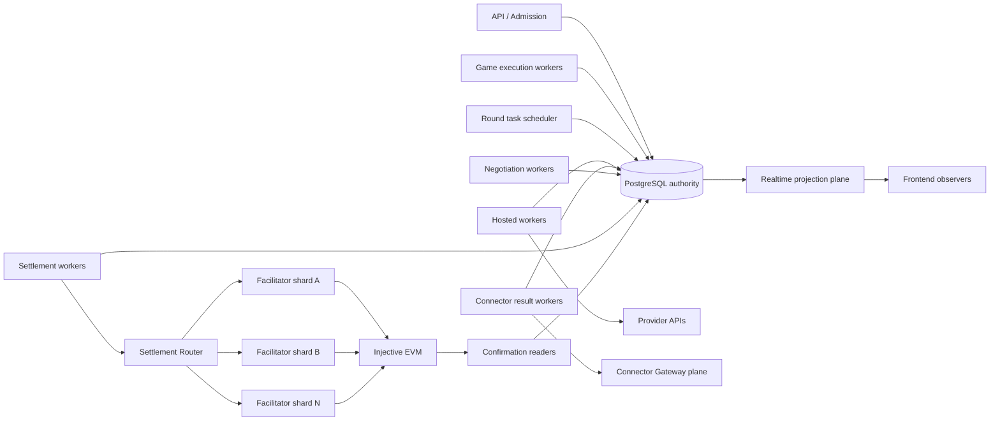

# Arena 402 数百 Agent 与多 Facilitator 扩容设计

> 状态：扩容实现与后续验收设计。代码和生产 Compose 已将单个 Current Game
> 硬上限改为 100，Hosted Runtime 以 4 副本 × 25 task slot 起步，Settlement
> Worker 以 4 个执行 slot 确定性路由到 4 个独立 EOA Facilitator shard。
> 当前可验证证据仍是 12 Agent 本地运行，不是 100 Agent 生产容量或四 shard
> live testnet 证明；以下未完成的 durable outbox、fencing、故障恢复和容量门槛
> 仍须逐项验收。

## 1. 目标与口径

扩容分成两个不同目标，不能混为一个“数百 Agent”数字：

1. **单局容量**：一局最多 100 个 Agent，共享同一事件、FCFS 市场、协商和排名；
2. **平台容量**：最多 3 局同时运行、合计 300 个 active Agent。

当前生产配置里程碑是 100 Agent 单局与 4 Facilitator shard；300 active Agent
多局并发仍是后续目标。配置上限不是吞吐承诺，对外容量声明仍以本文验收证据为准。

本文不改变以下红线：

- Arena 仍是 Game、Round、AgentTask、Result、配对、协商、库存和排名的唯一权威；
- Hosted Runtime、Connector 或 Provider success 只能产生候选 Result；
- `accept` 后金额、Token、payer、payee 和 Intent 不得被结算层重定价；
- 只有链上确认后才能提交现金和库存；
- 每个 AgentTask 最多重试一次，不能因扩容增加 Provider/Model/Runtime fallback；
- FCFS 仍只使用 Result Sink 的数据库 `result_received_at`；
- 每笔 accepted trade 必须能映射到独立链上 transfer 证据；批量交易也不能只保留
  无法还原逐笔成交的净额。

## 2. 当前瓶颈

当前代码已有可复用的深模块，但几个 interface 把整轮或整条链路收得过大：

| 位置 | 当前行为 | 扩容影响 |
|---|---|---|
| `CurrentGameLifecycleWorker` | 代码、生产默认值和新 migration 已允许最多 100 人 | 已解除 12 人硬约束，但尚无 100 Agent 生产验收 |
| `PawnhouseAgentRuntimeCoordinator` | 一条 `runtime_run` lease 独占整轮 | 多个 Arena Worker 只能并行不同 Game，不能共同推进同一大局 |
| Decide apply | 先创建全部 Task，再按 participant 顺序等待和应用 | 先遇到慢任务时出现 head-of-line blocking，已完成 Result 不能及时应用 |
| Negotiation | pairing 之间 `gather` 并行，pairing 内严格串行 | 方向正确，但没有独立持久化 negotiation lease，进程故障恢复粒度仍偏大 |
| Hosted Worker | PostgreSQL `SKIP LOCKED` 领取，生产配置 4 副本 × 25 task slot | 已提供 100 个理论执行 slot，但缺少跨实例 Provider 配额和单局公平调度 |
| Game Orchestrator | 扫描 running Game，逐局判断并推进 | 状态转换大多幂等，但没有显式 game execution lease/fencing，不适合直接多副本 |
| Automatic Settlement Worker | 一次扫描后以 4 个有界执行 slot 并发处理 Intent | 数据库已有 attempt lease 和签名前 shard 持久化，但仍是单 Worker 进程 |
| Facilitator | 4 个独立 EOA shard；每个 shard 仍使用内存 Promise 队列并等待确认 | 已拆开跨 EOA 吞吐，单 shard 重启恢复、durable nonce outbox 和 fencing 尚未实现 |
| API / Connector WSS | 单 Uvicorn worker，连接和 rate limiter 在进程内 | 无法直接增加 API 副本；Local Agent 和公开 Realtime 会先成为入口瓶颈 |

删除这些 module 不会减少复杂度，只会把租约、一致性和恢复逻辑散落到调用方。
扩容应加深现有 module，并把 interface 缩小到可领取、可恢复的一项工作。

## 3. 容量模型

设：

- `N`：单局 Agent 数；
- `R`：回合数；
- `T`：最大协商轮次；
- `P <= floor(N / 2)`：单回合 pairing 数。

单回合最坏工作量：

```text
logical_agent_tasks = N + P * T
provider_attempts <= 2 * logical_agent_tasks
settlement_transfers <= P
```

当 `N=100`、`T=3`、`R=5` 时：

```text
每回合最多 250 个逻辑 AgentTask
每回合最多 500 次 Provider Attempt
每回合最多 50 笔链上 transfer
整局最多 1,250 个逻辑 AgentTask、250 笔 transfer
```

因此容量不能只由 `maxParticipants` 决定。每个部署必须发布并冻结一个
`capacity_profile_version`，至少包含：

```text
max_active_games
max_agents_per_game
decide_concurrency
negotiate_pairing_concurrency
provider_concurrency_by_provider
settlement_worker_concurrency
facilitator_shard_count
database_connection_budget
action_timeout_ms
settlement_timeout_ms
```

Admission module 在 Join/Start 前同时预留 AgentTask、Provider、Settlement 和数据库
预算。不能先收 100 人，再让不可控排队吞掉 action deadline。

## 4. 目标架构



扩容后的 seam 仍按权威划分：

- **Arena execution plane**：只推进持久化 Game 状态，不持有 Provider Key 或钱包；
- **Runtime execution plane**：领取 AgentTask，写候选 Result，不修改游戏业务；
- **Settlement plane**：校验 Mandate、签名、路由、提交和恢复，不重写 Intent；
- **Facilitator shard**：只验证和广播已冻结授权，不决定成交；
- **Realtime plane**：只投影公开事件，不成为业务状态权威。

PostgreSQL 在 100/300 目标阶段继续作为 durable queue 和业务权威。`LISTEN/NOTIFY`
可用于唤醒 Worker，但事件丢失时 Worker 必须仍能通过扫描恢复。只有真实压测证明
数据库队列成为瓶颈后，才引入 Kafka 等第二套日志系统。

## 5. Arena 执行层拆分

### 5.1 Game execution lease

新增 game-scoped execution lease，允许多个 Arena Worker 实例同时服务不同 Game，
但同一时刻一局只能有一个有效推进者：

```text
game_id
lease_owner
lease_epoch
lease_expires_at
updated_at
```

领取使用 `FOR UPDATE SKIP LOCKED`。每次状态写入都携带 `lease_epoch` 进行 fencing；
旧 Worker 即使在网络暂停后恢复，也不能继续推进。Current Game 生命周期、Deadline
Finalizer 和只读 confirmation reader 不与该 lease 混成一个 module：它们各自保持
独立 interface 和故障域。

### 5.2 RoundTaskBarrier module

把当前“整条 `runtime_run`”拆成 RoundTaskBarrier：

1. 在一个事务中冻结本轮所有 Decide participant view 和统一 deadline；
2. 同一事务中创建全部 AgentTask；
3. 提交后统一标记 `dispatch_ready`；
4. Hosted/Connector Worker 按 deadline、Game 和确定性 participant 顺序公平领取；
5. Result Sink 到达后，由独立 applicator 立即应用，不再按 participant 顺序等待；
6. Barrier 以 `applied + defaulted == expected` 为完成条件；
7. Deadline Finalizer 对未完成 Task 生成唯一 `pass`，Barrier 随后关闭。

这使 Task 创建、Runtime 执行、Result 应用和 Round barrier 各有单一 interface。
测试可以直接覆盖 Barrier 的 exactly-once 和 deadline 行为，提升 locality。

### 5.3 公平调度

数百 Agent 场景下，Worker wave 会直接影响 FCFS。正式 Tournament 必须满足：

- 所有 Decide Task 使用相同 `dispatch_ready_at`；
- scheduler 按 Game 预留并发，不能被 credential validation 或其他 Game 抢占；
- 同一 Provider 内采用确定性、按 round seed 洗牌的公平队列，不能总是优先较小
  participant ID；
- 记录 `dispatch_started_at`，公开披露本轮 launch skew；
- launch skew 或 platform queue age 超过冻结阈值时，该局不得作为公平性证据。

当前 `result_received_at` 规则不变。扩容解决的是平台施加的排队偏差，不是改写
FCFS 结果。

### 5.4 NegotiationLease module

每个 negotiation 是独立工作单元：

```text
negotiation_id
expected_turn_sequence
lease_owner
lease_epoch
lease_expires_at
```

不同 pairing 可由不同 Worker 并行领取；同一 pairing 只允许
`expected_turn_sequence` 的 Worker 创建下一条 Task。应用动作时用
`negotiation_id + turn_sequence` compare-and-swap，保证进程重启或重复 Result
不会跳轮、双写或并发报价。

### 5.5 Matching 保持单局确定性

100 Agent 单回合最多 50 组 pairing，当前按
`(result_received_at, pool_entry_id)` 排序的 PostgreSQL matching 仍可保持为一个
深 module。先用真实查询计划验证现有 `pool_entries_fcfs_idx`，仅在证据表明需要时
调整覆盖列；只有单事务锁时长超过容量预算时，再按 `round_id + good_id` 拆成
四个确定性分区。不要提前引入分布式撮合而破坏 FCFS 可复核性。

## 6. 多 Facilitator 设计

### 6.1 Shard 模型

目标完整 Facilitator shard 由以下部分组成：

- 一个独立 gas payer EOA；
- 一个该 EOA 的 durable submission outbox；
- 一个 active broadcaster 和可选 passive standby；
- 独立 bearer credential、gas 余额阈值、RPC 配额和健康状态。

不同 shard 必须使用不同 EOA。一个 EOA 同时只能有一个带 fencing 的 active
broadcaster；不能让多个无协调进程各自猜测 transaction nonce。

Settlement Router 维护不含私钥的 registry：

```text
facilitator_id
chain_id
token_address
relay_address
endpoint
status
weight
max_inflight
gas_balance_floor
routing_epoch
```

私钥仍只存在于批准的 signer/KMS 或隔离的 testnet key store，不能进入 Arena
数据库、日志或路由 registry。

### 6.2 确定性路由

当前起步实现按排序后的四个 shard，使用冻结 Intent hash 的 SHA-256 模运算：

```text
route_key = payment_requirements.extra.arena402IntentHash
shard_index = first_u64(sha256(route_key)) mod shard_count
```

选择结果在签名前持久化为 `facilitator_id`。同一个 Intent 的重试只允许领取相同
route，不能因配置变化静默换 shard。后续再引入 registry、`routing_epoch`、健康
过滤和 weighted rendezvous；gas 余额低、RPC 不健康或 pending nonce 超阈值时，
目标行为是停止接收新 Intent，同时继续恢复已有 outbox。

### 6.3 广播与确认解耦

当前 Facilitator 串行队列包含链上等待。目标状态机改为：

```text
route_assigned
  -> authorization_verified
  -> nonce_reserved
  -> transaction_signed
  -> broadcast
  -> tx_hash_persisted
  -> confirmed | reverted | recovery_required
```

Facilitator 的串行区只覆盖“为本 EOA 预留 nonce、持久化签名交易、广播并保存
tx hash”。收到 tx hash 后立即返回；链上 receipt、确认数、reorg 检查和库存提交
仍由 Arena 的只读 recovery/commit 链路完成。这样每个 shard 保持 nonce 顺序，
但不会因等待区块而阻塞下一笔广播。

`nonce_reserved` 必须先于广播持久化。可广播的 raw signed transaction 只能加密
保存在 Facilitator 隔离 outbox；Arena 数据库只保存 digest、transaction nonce 和
状态。若进程在广播前崩溃，standby 使用相同 outbox 和 transaction nonce 续传；
若在广播后、保存 hash 前崩溃，先按 relay address + transaction nonce 和
EIP-3009 authorization nonce 做只读恢复，不能直接换 shard 重发。

### 6.4 Failover 规则

| 当前状态 | 自动换 shard | 处理 |
|---|---|---|
| `route_assigned`，尚未签名/预留 nonce | 允许 | 增加 `routing_epoch`，记录原 shard 与原因 |
| `authorization_verified`，未进入 submission outbox | 允许 | 复核 authorization 未过期后重路由 |
| `nonce_reserved` 或 `transaction_signed` | 不允许 | 同 shard standby 接管 durable outbox |
| `broadcast` 或存在 tx hash | 不允许 | 只读恢复 receipt/authorization state |
| `submission_unknown` | 不允许 | 保持 Round 阻塞，恢复到 hash、reverted 或明确未提交 |

EIP-3009 authorization nonce 能防止重复转账，但不能避免两个 relay 为竞争交易都
支付 gas。route 持久化、broadcaster fencing 和 outbox 恢复三者都必须存在。

### 6.5 Shard 数量

设单 shard 串行广播一笔所需 P95 为 `B95`，一轮结算的广播预算为 `W`，最坏
accepted trade 数为 `S`：

```text
facilitator_shards >= ceil(S * B95 / W)
```

当前 100 Agent 生产配置从 4 个 shard 起步，再按真实 `B95`、Injective RPC
限流、mempool 和 gas 余额决定是否增至 8 个或更多。4 shard 是实现与压测起点，
不是已验证吞吐承诺。

## 7. Settlement Worker 扩容

Automatic Settlement Worker 改成“先 claim，再执行”的有界并发：

1. 使用 `SKIP LOCKED` 一次领取最多 `settlement_worker_concurrency` 个 Intent；
2. claim 后再 reserve Mandate，避免未领取成功的 Worker 占住额度；
3. 对 signer、Router 和每个 Facilitator shard 分别设置 semaphore；
4. `submitting` 之前持久化 ambiguity boundary；
5. tx hash 到达即保存并释放执行 slot；
6. confirmation reader 与 inventory commit 使用独立 Worker 池。

多副本仍共享同一 `x402_settlement_attempts`/Intent 权威状态。扩容不得通过创建新
authorization、修改 Intent 或跳过 `submitted_unknown` 恢复来提高表面吞吐。

## 8. API、Connector 与 Realtime

100 Agent 单局的 Hosted-only 压测可以先不扩公开 WebSocket，但 300 Agent 平台
目标必须移除单 API worker 限制：

- 把 Connector socket ownership 移到独立 Gateway plane；
- 使用 `device_id` 一致性哈希或 L7 sticky routing 把同一设备固定到一个 Gateway；
- PostgreSQL 保存 Device、Binding、Command、receipt 和 ACK watermark；
- Redis 只保存短期 presence、跨实例 wake-up 和分布式 rate-limit，不保存业务权威；
- 前端 Realtime 从 `game_events`/outbox 投影，不直接订阅 Worker 内存状态；
- REST API 变为无状态多副本，数据库前增加 PgBouncer，并按总连接预算限制各池。

若 Redis 不可用，Connector 可以暂时无法实时派发，但 durable Command/Task 不能
丢失；恢复后从 PostgreSQL watermark 继续。

## 9. 数据库与部署

### 9.1 最小新增持久化

优先扩展现有表而不是复制业务状态。建议的新增/扩展记录：

- `game_execution_leases`：Game 推进 lease 和 fencing epoch；
- Round barrier 字段或独立 `round_task_barriers`：expected/applied/defaulted 计数；
- negotiation lease 字段：owner、epoch、expiry、expected turn；
- `facilitator_registry`：公开路由和健康元数据；
- `settlement_routes`：Intent 的冻结 shard 和 routing epoch；
- `facilitator_submissions`：EOA transaction nonce、signed tx digest、tx hash 和恢复状态；
- capacity profile 与 Game 冻结的 profile version。

所有计数都应能从权威行重算；缓存计数只用于快速 barrier 判断，更新必须与业务
状态位于同一事务。

### 9.2 连接与存储

每次增加 Worker 副本前必须满足：

```text
sum(replica_count * pool_max_size) <= 70% * PostgreSQL max_connections
```

其余连接留给迁移、监控、恢复和故障切换。先使用 PgBouncer transaction pooling、
针对 claim/barrier 查询的覆盖索引和慢查询证据；不要仅为容量目标提前分库。

当 300 Agent 压测持续显示单 PostgreSQL 写入成为瓶颈时，再按 Game 做物理分片。
每个 Game 的全部 Round/Task/Pairing/Settlement 业务行必须落在同一 shard，公开
账本通过只读汇聚层查询，避免跨库事务参与游戏推进。

## 10. 分阶段实施

### Phase S0：100 人配置基础

- [x] 以新 migration、代码校验和生产默认值把 Current Game 硬上限改为 100，
  不修改历史 migration；
- [x] 生产 Hosted Worker 配置改为 4 副本 × 25 task slot，PostgreSQL
  `max_connections` 起步值改为 120；
- [ ] 完成真实 10/12 Agent 回归与 25/50/100 Agent、自动 testnet settlement
  验收；
- 增加 task queue age、dispatch skew、barrier time、DB pool wait、settlement queue
  age、Facilitator pending nonce、gas balance 和 confirmation latency 指标；
- 保存 12 Agent 基线报告，冻结容量 profile v1。

### Phase S1：32 Agent 执行层

- 实现 GameExecutionLease、RoundTaskBarrier、Result applicator 和
  NegotiationLease；
- Hosted Worker 多副本配置已完成；补齐全局 Provider 配额；
- 先用 deterministic/fake Provider 完成 32 Agent × 10 回合故障注入；
- 再用真实 Provider 完成 32 Agent × 5 回合；
- 在 100 Agent live 验收前只把该上限视为 Operator-controlled capacity profile。

### Phase S2：多 Facilitator testnet

- [x] 实现基于冻结 Intent hash 的 deterministic Router、签名前
  `facilitator_id` 持久化、4 个 Settlement 执行 slot 与 4 个独立 EOA 服务；
- [ ] 实现 health registry、routing epoch、durable submission outbox 和
  broadcaster fencing；
- [ ] 将每 shard 的广播与确认解耦；当前每个 shard 内部仍串行等待确认；
- 验证 shard 进程在 nonce reserve 前后、broadcast 前后崩溃；
- 验证一个 shard 停止接新单时，其余 shard 承接新 route，已有 outbox 不重复支付；
- 32 Agent 受控场景产生最多 16 笔 accepted trade 并全部进入安全终态。

### Phase S3：100 Agent 单局

- [x] 以新 migration 把 Current Game 的 12 人产品约束改为 100；
- [x] 生产配置预留 100 个 Hosted Task slot 和 4 个 Facilitator shard；
- [ ] 验证 100 个 Decide 和最多 50 个 pairing 的公平 launch；
- 完成 100 Agent × 5 回合，最坏 50 笔/回合 settlement；
- live 验收通过后才可对外声明 100 Agent 生产容量。

### Phase S4：300 Agent 平台

- `current_game` 保留为 featured Game 指针，新增多 Game admission/catalog；
- 最多 3 局并行，每局冻结独立 capacity profile；
- REST API 多副本、独立 Connector Gateway plane、Redis presence/rate-limit、
  PgBouncer；
- Game 按 `game_id` 分配 execution worker，Provider 与链上容量按平台全局限流；
- 通过三局同时运行、单局故障不拖垮其他 Game 的验收。

## 11. 验收门槛

每个阶段必须同时通过正确性、容量和故障恢复，不能只看“最终完成”：

### 正确性

- 一个 Task Result 最多应用一次；
- 一个 participant 每轮最多进入一个 pool；
- 一个 pairing 的 `turn_sequence` 单调且无分叉；
- 一个 SettlementIntent 只对应一个 EIP-3009 authorization nonce；
- 任意 Facilitator/Worker 重启后不重复付款、不跳过 unknown recovery；
- confirmed transfer 才能提交一次库存；reverted/expired 不改变库存；
- 最终排名可从快照和 settle table 独立重算。

### 容量

- P99 platform queue age 小于冻结 `action_timeout_ms` 的 10%；
- Decide launch skew 小于 capacity profile 的公平性阈值；
- 无 Task 因 Worker wave 在开始前已经过期；
- PostgreSQL pool 无耗尽，P99 pool wait 小于冻结预算；
- settlement queue age 不消耗超过 authorization 有效窗口的 25%；
- 每个 Facilitator EOA 的 transaction nonce 连续，无无法解释的 gap；
- gas/RPC/provider 限流触发 backpressure，而不是无界重试。

### 故障注入

- kill 任意 Hosted/Arena/Settlement Worker；
- kill active Facilitator broadcaster 的四个关键时点；
- 单 shard gas 余额不足、RPC 超时和 429；
- Result 重复/乱序、lease 过期后旧 Worker 恢复；
- Redis/Realtime plane 不可用；
- confirmation provider 暂时分叉或无法确认。

业务不变量必须全部保持；无法获得安全链上证据时 Game 进入
`settlement_recovery_required`，不能为了容量继续 Round 或生成排名。

## 12. 对外声明

只有完成对应验收后才能使用以下表述：

- S1 通过：`已验证 32 Agent 单局 Runtime/协商扩容`；
- S2 通过：`已验证多 Facilitator testnet 路由与故障恢复`；
- S3 通过：`已验证 100 Agent 单局和逐笔链上结算`；
- S4 通过：`已验证 300 active Agent 多局并发`。

设计完成、Fake E2E、创建多个 EOA 或把配置改成 100，都不能单独支持“数百 Agent
生产运行”或“多 Facilitator 高可用已经实现”的申报表述。
